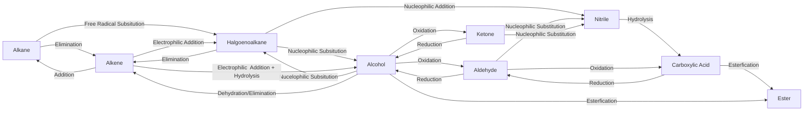

```mermaid
graph LR
A[Alkane] -->|Elimination|B[Alkene]
B-->|Addition|A
A-->|Free Radical Subsitution|G[Halgoenoalkane]
G -->|Elimination|B
B -->|Electrophilic Addition|G
G -->|Nucleophilic Subsitution|C
C -->|Nucelophilic Subsitution|G
G -->|Nucleophilic Addition|H[Nitrile]
H -->|Hydrolysis|F
C -->|Dehydration/Elimination|B
B -->|Electrophilic  Addition + Hydrolysis|C[Alcohol]
C -->|Oxidation|D[Aldehyde]
F-->|Reduction|D
D-->|Nucleophilic Substitution|H
E -->|Nucleophilic Substitution|H
D -->|Reduction|C
C -->|Oxidation|E[Ketone]
E -->|Reduction|C
D -->|Oxidation|F[Carboxylic Acid]
F-->|Esterfication|I[Ester]
C-->|Esterfication|I
```

