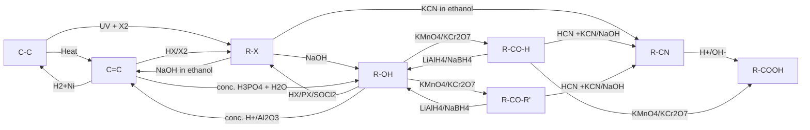

```mermaid
graph LR
A[C-C] -->|Heat|B[C=C]
B-->|H2+Ni|A
A-->|UV + X2|G[R-X]
G -->|NaOH in ethanol|B
B -->|HX/X2|G
G -->|NaOH|C
C -->|HX/PX/SOCl2|G
G -->|KCN in ethanol|H[R-CN]
D-->|HCN +KCN/NaOH|H
E-->|HCN +KCN/NaOH|H
H -->|H+/OH-|F
C -->|conc. H+/Al2O3|B
B -->|conc. H3PO4 + H2O|C[R-OH]
C -->|KMnO4/KCr2O7|D[R-CO-H]
D -->|LiAlH4/NaBH4|C
C -->|KMnO4/KCr2O7|E[R-CO-R']
E -->|LiAlH4/NaBH4|C
D -->|KMnO4/KCr2O7|F[R-COOH]

```

