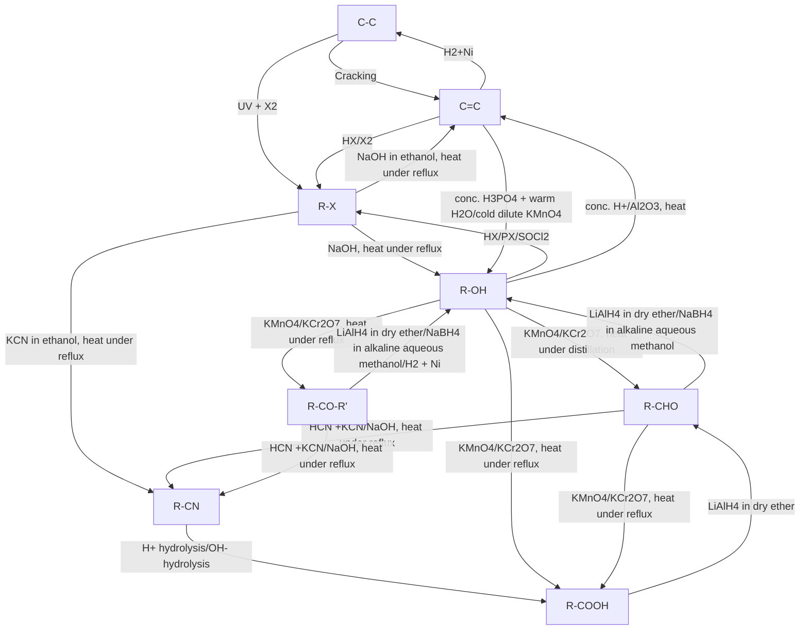

```mermaid
graph TB
A[C-C] -->|Cracking|B[C=C]
B-->|H2+Ni|A
A-->|UV + X2|G[R-X]
G -->|NaOH in ethanol, heat under reflux|B
B -->|HX/X2|G
G -->|NaOH, heat under reflux|C
C -->|HX/PX/SOCl2|G
G -->|KCN in ethanol, heat under reflux|H[R-CN]
D-->|HCN +KCN/NaOH, heat under reflux|H
E-->|HCN +KCN/NaOH, heat under reflux|H
H -->|H+ hydrolysis/OH- hydrolysis|F
C -->|conc. H+/Al2O3, heat|B
B -->|conc. H3PO4 + warm H2O/cold dilute KMnO4|C[R-OH]
C -->|KMnO4/KCr2O7, heat under distillation|D[R-CHO]
D -->|LiAlH4 in dry ether/NaBH4 in alkaline aqueous methanol|C
C -->|KMnO4/KCr2O7, heat under reflux|E[R-CO-R']
E -->|LiAlH4 in dry ether/NaBH4 in alkaline aqueous methanol/H2 + Ni|C
C-->|KMnO4/KCr2O7, heat under reflux|F
D -->|KMnO4/KCr2O7, heat under reflux|F[R-COOH]
F -->|LiAlH4 in dry ether|D
```

